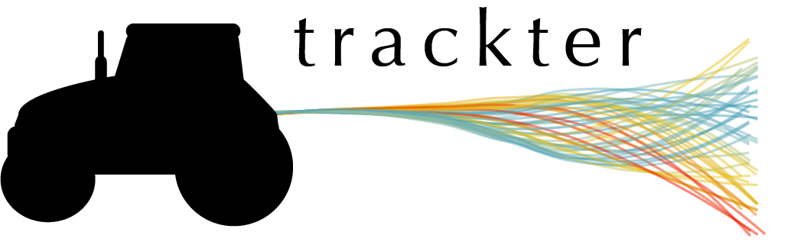

This is a development version of *trackter*, an R package that performs semiautomated tracking and analysis of 2D kinematics from video and image data.
=======================================================================================================================================================

Please report any bugs or performance issues---this page is currently
under development.

To install:

    require(devtools)
    install_github("ckenaley/trackter")
    require(trackter)  

<b> A tutorial can be found here:

https://github.com/ckenaley/trackter/blob/master/tutorial.md

