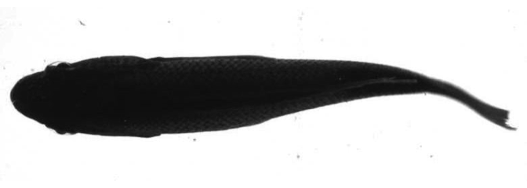
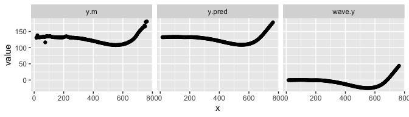
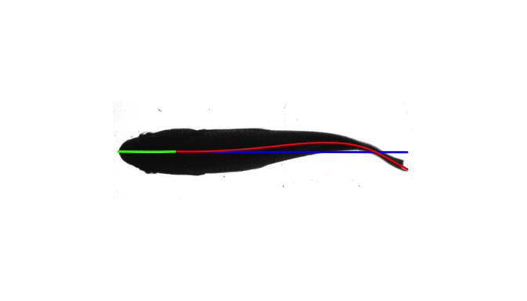
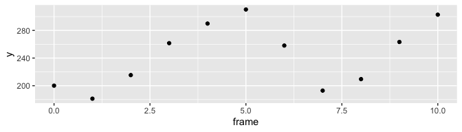
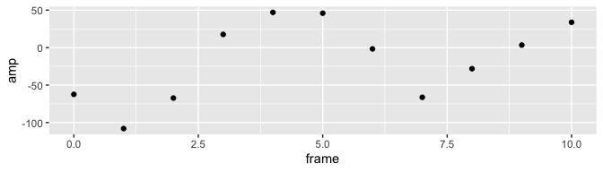
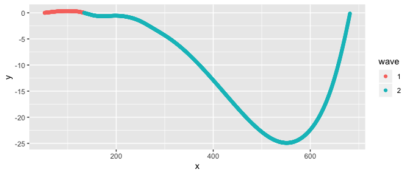
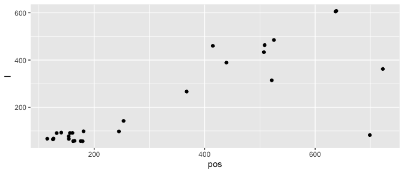

[](https://travis-ci.com/ckenaley/trackter)
[](https://ci.appveyor.com/project/ckenaley/trackter)

<!-- README.md is generated from README.Rmd. Please edit that file -->

# *trackter*

## Description

*trackter* is an R package for semiautomated tracking and analysis of 2D
kinematics from video and image data. The core functions of *trackter*
automatically detect a region of interest (ROI) and compute important
kinematic and shape parameters based on the ROI’s contour. These
functions use thresholding and segmentation to identify ROIs and, thus,
moderately contrasted images are required. Below, some of *trackter*’s
functionality is detailed and examples of its usage in the context of
fish locomotion are presented.

Please report any bugs or performance issues—this page is currently
under development.

## Installation

``` r
    require(devtools)
    install_github("ckenaley/trackter")
    require(trackter)
```

## External dependencies

The core functions of *trackter* that extract shape and contour data
from images ( `kin.simple` and `kin.search`) depend upon *EBImage*,
available on the Bioconductor repository. The current build version of
*trackter* installs this dependency. If it does not install,it can be
done so easily with just a few lines of code:

``` r
  if (!requireNamespace("BiocManager", quietly = TRUE))
   install.packages("BiocManager")
   BiocManager::install("EBImage")
```

*trackter* also contains several functions for image and video
processing. These functions depend on the popular `FFmpeg` package and
it must be installed if the user intends to use them. Installation is
platform-dependent. I found the [`FFmpeg` wiki installation and
compilation guide to be quite
useful](https://trac.ffmpeg.org/wiki/CompilationGuide).

## Features

**Automated kinematic analysis**

  - Fast and accurate contour and shape analysis of ROIs.
  - ROI detection with search parameters including position and size.
  - Relevant functions: `kin.search` and `kin.simple`.

**Tools for kinematic analysis of swimming animals**

  - Calculate midline (propulsive) wavelength, trailing-edge frequency,
    paired-fin position.
  - Relevant functions: `amp.freq`, `halfwave`, `wave`, and `fin.kin`

**Tools for image and video processing using FFmpeg**

  - Access `FFmpeg` functionality, including filters and codecs, to
    extract frames, stitch videos, and edit images and videos.

  - Relevant functions: `images.to.videos`, `images.to.videos2`,
    `vid.to.images`, and `vid.to.images2`

**Other miscellaneous, low-level tools for kinematic analysis**

  - Compute distances in 2d space, angles, heading/bearing, convert
    radians to degrees and vice versa.
  - Relevant functions: `dist.2d`, `cosine.ang`, `bearing.xy`, `deg`,
    `rad`

## Examples

### Analyzing a single image

*trackter* was developed to analyze image data from videos of swimming
fishes, although any object in an image field has potential for
analysis. Here, we start by accessing an image of a swimming fish from
*trackter*’s system data, reading it, writing it to a local
subdirectory, and displaying
it.

``` r
y <- EBImage::readImage(system.file("extdata/img", "sunfish_BCF.jpg", package = "trackter"))
t <- paste0(tempdir(),"/images")
dir.create(t)
EBImage::writeImage(y,paste0(t,"/sunfish001.jpg"),type = "jpeg")
EBImage::display(y,method="raster")
```



Here, `kin.simple` is used to extract contour and shape information.

``` r
kin.y <- kin.simple(image.dir = t,out.dir = tempdir())
```

The `kin` functions in *trackter* return a list of data tables/data
frames:

``` r
print(sapply(kin.y,class))
#> $kin.dat
#> [1] "data.table" "data.frame"
#> 
#> $midline
#> [1] "data.table" "data.frame"
#> 
#> $cont
#> [1] "data.table" "data.frame"
#> 
#> $all.classes
#> [1] "data.table" "data.frame"
#> 
#> $dim
#> [1] "integer"
```

Most will be interested in the “kin.dat” and “midline” data for the
calculation of body shape and position parameters (e.g., amplitude,
wavelength, etc.). For example, “kin.dat” table includes, among other
things, frame-specific trailing-edge (rightmost) amplitude (“x”, “y”),
head (leftmost) position (“head.x”, “head.y”) which may be used to
calculated position and trailing-edge amplitude.

``` r
print(kin.y$kin.dat)
#>    frame   x        y head.x   head.y      amp  head.pval roi  edge   size
#> 1:     0 756 176.0573     22 132.2365 43.89692 0.09313962   a FALSE 169710
```

The “midline” table is composed of frame-specific midline data,
including, among other things, calculated midline position (“y.m”),
smoothed midline position (“y.pred”) and midline position relative to
the head (“wave.y”).

``` r

print(kin.y$midline)
#>      frame   x y.min y.max      y.m   y.pred mid.pred     wave.y roi
#>   1:     0  15   126   135 130.5000 132.0820 132.4722 -0.3902418   a
#>   2:     0  18   120   143 131.5000 132.1169 132.4787 -0.3618073   a
#>   3:     0  22   115   150 138.0000 132.1622 132.4873 -0.3251254   a
#>   4:     0  26   110   154 132.0000 132.2074 132.4959 -0.2885076   a
#>   5:     0  30   107   157 132.0000 132.2541 132.5046 -0.2504894   a
#>  ---                                                                
#> 196:     0 747   153   178 168.5000 168.9439 134.0515 34.8924030   a
#> 197:     0 751   154   180 165.4545 171.1997 134.0601 37.1395741   a
#> 198:     0 755   178   181 179.5000 173.4628 134.0688 39.3940451   a
#> 199:     0 759   179   181 180.0000 175.7262 134.0774 41.6488237   a
#> 200:     0 763   180   181 180.5000 177.9829 134.0860 43.8969174   a
library(ggplot2)
library(data.table)
ml <- melt(kin.y$midline[,.(x,y.m,y.pred,wave.y)],"x")
qplot(data=ml,x=x,y=value)+facet_wrap(variable~.)
```

<!-- -->

When “save=TRUE” (the default), the `kin` functions write images to a
“processed\_images” subdirectory that include midline overlays.

``` r

y2 <- EBImage::readImage(paste0(tempdir(),"/sunfish001_000.jpg"))
EBImage::display(y2,method="raster")
```

<!-- -->

``` r

#clean up
unlink(t,recursive = T)

unlink(paste0(tempdir(),"/sunfish001_000.jpg"))
```

### Analyzing a video and multiple images

Of course, the primary utility of automated tracking routines is to
process many images (i.e., frames). The `kin` functions analyze all the
images in a subdirectory and assume they are ordered by a numbered
suffix. One can use the `FFmpeg` wrappers `vid.to.images` or
`vid.to.images2` to extract a numbered sequence from a video. Users may
otherwise produce an image sequence from their videos using other
software (e.g., ImageJ). Here, `vid.to.images` extracts images from a
video of a swimming fish to a subdirectory named “images” and these are
passed through `kin.simple`. The threshold value for segmenting is set
to 0.6 and the head section (“ant.per”) set to 0.2 in this
case.

``` r
  v <- system.file("extdata/vid", "sunfish_BCF_red.avi", package = "trackter")
  
  file.copy(v,tempdir())
  ti <- paste0(tempdir(),"/images")
  tv <- paste0(tempdir(),"/sunfish_BCF_red.avi")
  print(file.exists(tv))
  dir.create(ti)
  vid.to.images(tv,out.dir=ti)  

  kin.y2 <- kin.simple(image.dir = ti,thr=0.6,ant.per = 0.2,save = FALSE)
  
  #cleanup
  unlink(ti,recursive = T)
  unlink(tv)
  
```

Now we can have a look at trailing-edge position and amplitude (relative
to the head path) across the
frames.

``` r
qplot(data=kin.y2$kin.dat,x=frame,y=y) #position
```

<!-- -->

``` r
qplot(data=kin.y2$kin.dat,x=frame,y=amp) #amplitude relative to a theoretical midline established by head
```

<!-- -->

The midline data can be accessed to assess amplitude envelope. Here,
midline x position is standardized.

``` r
kin.y2$midline[,x2:=x-x[1],by=frame]

qplot(data=kin.y2$midline,x=x2,y=wave.y,col=frame)
```

<!-- -->

### Downstream analyses of kinematic data

*trackter* supplies several functions for downstream analysis of
kinematic data extracted from image frames. For instance, `half.wave`
computes the midline half wavelength (i.e., propulsive wavelength in
pixels) from a data table of x and y position data. These and other
functions are intended for use with output from the `kin` functions.

``` r
w <- halfwave(x=kin.y$midline$x,y=kin.y$midline$wave.y,method="zeros")
print(w)
#> $method
#> [1] "zeros"
#> 
#> $names
#>               x            y wave
#>    1:  52.41871  0.002125360    1
#>    2:  52.79290  0.006386944    1
#>    3:  53.16708  0.010648877    1
#>    4:  53.54127  0.014909172    1
#>    5:  53.91546  0.019165844    1
#>   ---                            
#> 1679: 680.30465 -0.800012618    2
#> 1680: 680.67884 -0.629218056    2
#> 1681: 681.05303 -0.457931956    2
#> 1682: 681.42721 -0.286163750    2
#> 1683: 681.80140 -0.113922867    2
#> 
#> $dat
#>    wave zeros wave.begin wave.end begin.index end.index         l
#> 1:    1   101   52.41871 132.9915         101       318  81.57279
#> 2:    2   319  133.99150 681.1756         319      1783 548.18409
#>          amp1 amp2      pos1 pos2
#> 1:  0.3447083   NA  98.81791   NA
#> 2: 24.9167308   NA 551.21011   NA
```

Using a “zeros” method, `half.wave` determines two half waves from the
ROI in the single image above, described in the “dat” table from the
output. The “names” table can be used to visualize the half wavelengths.

``` r
qplot(data=w$names,x=x,y=y,col=wave)
```

<!-- -->

We could extend this framework using `data.table` to calculate half
waves in each of the 11 frames from the example
video.

``` r
 wave.dat <- kin.y2$midline[, { w <- halfwave(x,wave.y,method="zeros")$dat;
 list(l=as.numeric(w$l),
    amp=as.numeric(w$amp1),
    pos=as.numeric(w$pos1),
    start=as.numeric(w$wave.begin),
    end=as.numeric(w$wave.end))},
     by=.(frame)]

qplot(data=wave.dat,x=pos,y=l)
```

<!-- -->
