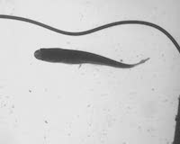
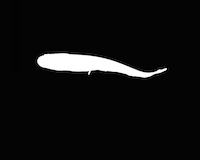
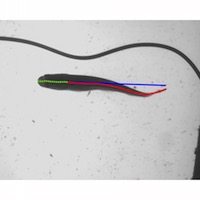

# Introduction
  
<br>

_trackter_ extracts 2D kinemtics from video and image data. Although `trackter` was developed for analysis of swimming fishes, this package should prove useful for those interested in waveforms of any undulating or oscillating body in a pixel field. The intent is to find body midline positions and, from that, compute trailing-edge frequency and amplitude. The basic premise here is that a modestly contrasted image of the moving body can be transformed into a binary image rather easily and those negative (i.e., black pixels) can be used to infer the position of the midline. Specifically, the midline is calculated from the column-wise midpoint of negative pixels. The midline data are then plotted onto the original images from the video and those images are stiched together to produce an MPEG complete with undulating fish and midline data. So you go from . . .


 $\rightarrow$ 

$\rightarrow$ 



Functions also return values for relevant kinematic paramters, including midline x and y positions and rightmost (i.e., trailing edge) amplitude, among others.

# What you need

If you'd like to process videos, the package assumes assumes that you have [ffmpeg](https://www.ffmpeg.org/) installed. ffmpeg is handy for anybody working with image data and it couldn't be easier to install, whether for [Mac OS](https://github.com/fluent-ffmpeg/node-fluent-ffmpeg/wiki/Installing-ffmpeg-on-Mac-OS-X), [Windows](https://github.com/adaptlearning/adapt_authoring/wiki/Installing-FFmpeg), or [Linux](https://www.ostechnix.com/install-ffmpeg-linux/).

The back lighting---as in the examples presenter here--was accomplished with an [LED light box](http://a.co/hIbIxNq) placed under a swim tunnel and video was captured at 100 fps from dorsal view. This creates some pretty good contrast. However, the scripts in _trackter_ have been tested on a few dark fish swimming on light back grounds and the results are comparable.

If you have an image sequence, you don't need ffmpeg installed. To extract images from a video or to stich outputted images (those with overlayed mideline track) you could perform some simple opertions in something like [imageJ](https://imagej.nih.gov/ij/)). By using _trackter's_ `kin.img`, near total automation of the waveform estimation is possible. With ffmpeg installed, the user can invoke `kin.vid` to extract the images, find midlines for each, plot the midlines, and then return the midline parameters for each frame (x and y position, tail amplitude, etc.).


# Install and load

Use the `dev.tools` package to install `trackter`, then load it:

```{r,  message=F}
  require(devtools)
  install_github("ckenaley/trackter")
  require(trackter)
```

# Preliminaries

Because the goal of many projects focused on locomotor kinematics is to determine waveform paramters,  including wavelength, wave speed, and trailing edge amplitude, we need a point of reference. For this, _trackter__ computes a midline determined by a prediction from an linear model of the some anterior part of the body. That is, it assumes the leading edge (the head in this example) is stiff and thus is will serve as the point of reference to determine waveform paramters. The midline and waveform is projected along the length of deginated ROI and, based on the trailing edge position, the amplitude is calculated as the distance between the trailing edge and the predicted midline. 

#An example

Download an example video (the exact one from above) and create a classic midline waveform plot. First, load some packages, then download the video.

```{r, message=F}
 require(wesanderson) #for nice colors
 require(ggplot2) #for nice plotting
 require(plyr) #for nice data operations

 #download an example video (7.5 MB) and place in working directory
  f <- "https://github.com/ckenaley/exampledata/blob/master/trout1_63_test.avi?raw=true"
 download.file(f, file.path(getwd(), "trout1_63_test.avi"), method = "libcurl")

```


Next, with `kid.vid` we'll extract  the images from the downloaded AVI and compute the midline positions and store them. The threshold ("thr") value of 0.7 works well for backlit images like the onces in this video. We'll only process the first 50 frames, and produce a video with midline postions plotted over the original frames with a playback frame rate of 10 fps. By default, `kid.vid` assumes the ROI (the body of interest) is the largest group of negative pixels in the field. However, should it not be, you can indicated the ROI of interest as the nth largest in the field with "n.blob".

```{r, message=F,results='hide'}
kin <- kin.vid(vid.path ="trout1_63_test.avi",thr=0.7,frames=1:5,frame.rate=10,flip = T)

ml <- kin$midline
```

Check that the MP4 vide---complete with midlines plotted over the original video---exists.

```{r, message=F}
file.exists("trout1_63_test.mp4")
```

Now, we'll compute corrected x positions of the leading edge normalized to the first (leftmost) pixel of the ROI, then compute the trainling-edge amplitude (assumed to be the last few pixels in the waveform) for each frame, and then merge the two.

```{r,message=F}
ml <- ddply(ml,.(frame),transform,x2=x-x[1])

ml2 <- ddply(ml,.(frame),summarize,amp.i=last(wave.y))

ml <- merge(ml,ml2,by="frame") #merge these
```

OK, let's choose a nice color palette and plot the waveforms for each of the 50 frames and colo them according to trainling edge amplitude.
```{r}
pal <- wes_palette("Zissou1", 100, type = "continuous") #"Zissou" color palette
p <- ggplot(dat=ml,aes(x=x2,y=wave.y))+theme_classic(15)+scale_color_gradientn(colours = pal)
p+geom_line(aes(group=frame,color=amp.i),stat="smooth",method = "loess", size = 1.5,alpha = 0.5)
```


