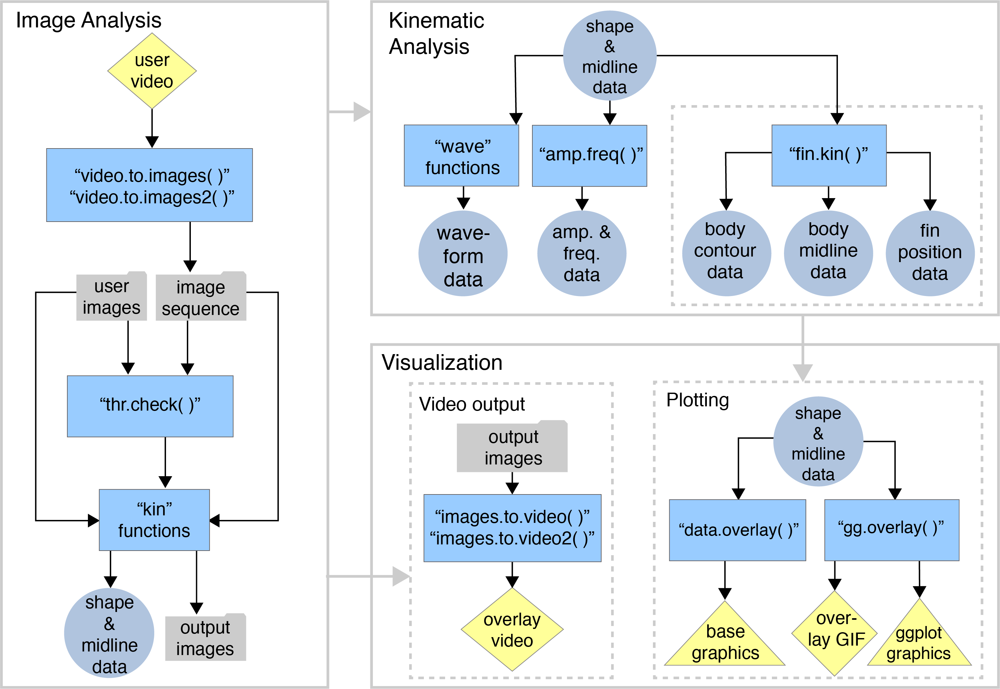

## Installation

The release version of *trackter* can be installed with:


```{r inst1,eval=FALSE}
install.packages("trackter")
```

The current development version can be installed with:


```{r inst,eval=FALSE}
    require(devtools)
    install_github("ckenaley/trackter")
    require(trackter)
```


## External dependencies

The core functions of *trackter* that extract shape and contour data from images (the `kin` functions: `kin.simple`, `kin.search`, and `kin.free`) depend upon `EBImage`, available on the Bioconductor repository. The current build and development versions of `trackter` install this dependency. If it does not install, it can be done so easily with just a few lines of code:


```{r bioc,eval=FALSE}
  if (!requireNamespace("BiocManager", quietly = TRUE))
   install.packages("BiocManager")
   BiocManager::install("EBImage")
```

*trackter* also contains several functions for image and video processing. These functions depend on the `av` package, which interfaces directly with an FFMPEG C API. Thus, there is no need to install FFMPEG separately. 

**UPDATE (Jan '22)** When installing `av` on MacOS running the development version of R, `FFMPEG` and `fftw` must be indeed be installed. `brew install ffmpeg fftw`.

## Workflow

{width=600px}


The workflow diagram above outlines how the functions within `trackter` may be used. Image analysis, whereby ROIs are detected and their shape information extracted, is the logical starting point. Users can begin with either a directory of images or a video. In the latter case, `trackter`'s image extraction functions may be used to establish a directory of images. The [`kin` functions](#the-kin-functions-1) (`kin.simple()`, `kin.search()`, and `kin.free()`) perform the shape extraction, returning a series of tables for downstream [kinematic analysis](kinematic_analysis.html) and [visualization](visualization.html).


## An Example


```{r load}
library(trackter)
library(ggplot2)
library(data.table)
```

`trackter` was developed to analyze image data from videos of swimming organisms, although any object in an image field has potential for analysis. Here, we start by accessing an image of a swimming fish included with the package in a directory named "img" and displaying it.


```{r image}
i <- system.file("extdata/img","sunfish_BCF.jpg",package="trackter")
y <- EBImage::readImage(i)

EBImage::display(y,method="raster")
```


Here, `kin.simple` is used to extract contour and shape information from the image above by referring to the directory that contains it. An image with a midline overlay is saved to the working directory (see below).


```{r kin}

dir <- system.file("extdata","img",package="trackter")

im <- list.files(system.file("extdata/img", package = "trackter"),full.names = TRUE)
im<- im[grepl("sunfish.jpg",im)]
im.dir <-paste0(getwd(),"/images")
dir.create(im.dir)

file.copy(im,paste0(im.dir,"/",basename(im)))

kin.y <- kin.simple(image.dir = im.dir,save=TRUE,out.dir = getwd())
```

The `kin` functions in *trackter* return a list of data tables:

```{r table}
print(sapply(kin.y,class))
```

Most will be interested in the "kin.dat" and "midline" data for the calculation of body position parameters (e.g., amplitude, wavelength, etc.). For example, the "kin.dat" table includes, among other things, frame-specific trailing-edge (rightmost) amplitude ("x", "y"), head (leftmost) position ("head.x", "head.y") which may be used to calculate position and trailing-edge amplitude.


```{r dat}
print(kin.y$kin.dat)
```

The "midline" table is composed of frame-specific midline data, including, among other things, calculated midline position ("y"), smoothed midline position ("y.sm") and midline position relative to the head ("wave.y"). Here we see the difference between them.


```{r plot}
print(head(kin.y$midline))
ml <- melt(kin.y$midline[,.(x,y,y.sm,wave.y)],"x")
qplot(data=ml,x=x,y=value)+facet_wrap(variable~.)
```

When "save=TRUE", the `kin` functions write images to a user-defined directory that include midline overlays.

```{r res}
y2 <- EBImage::readImage("sunfish_000.jpg")
EBImage::display(y2,method="raster")
#clean up
unlink(im.dir,recursive=TRUE)
```

```{r cleanup,echo=FALSE}
#clean up
unlink("sunfish_BCF_000.jpg")
```

```{r remimages,include=FALSE}
im.rem <- list.files(pattern = "images")

sapply(im.rem,function(x) if(dir.exists(x)) unlink(x,recursive = TRUE))
```
