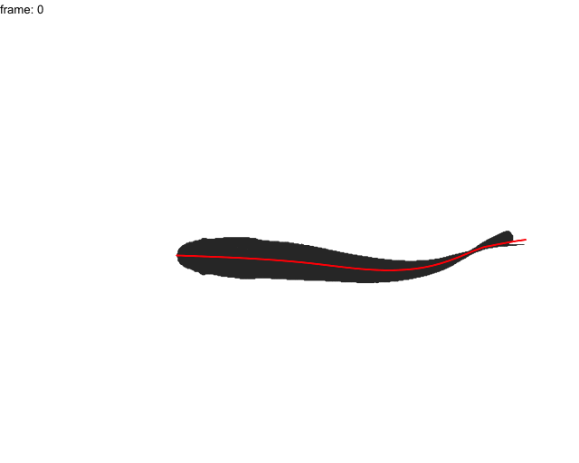

`trackter` offers users several simple plotting functions for the visualizations of ROI contours, midlines, and position data. 

## Visualizing results from `kin` functions

The `kin` functions `kin.search()`, `kin.simple()`, and `kin.free()` all allow users to overlay midline data over original images with if `save=TRUE` and an output directory is specified with the argument `out.dir`. 

Here, the frames from a video of a swimming juvenile rainbow trout loaded with the package are extracted with `video.to.images()` and saved to an appropriately named directory.

```{r,message=FALSE,warning=FALSE}
library(trackter)
trout.vid <- system.file("extdata/vid", "trout.avi", package = "trackter")
dir.create("./trout_images")
vid.to.images(vid.path = trout.vid, out.dir = "./trout_images")
```

Next, an output directory is created for storing the original images with the midline overlay.  Then, position and shape data are retrieved using  `kin.simple()` with `save=TRUE` and the output directory specified by `out.dir`. 

```{r kin}
dir.create("./trout_midline")
trout.kin <- kin.simple(image.dir = "./trout_images",save = TRUE, out.dir = "./trout_midline")
```

Images, complete with midline data, are now stored in the output directory.

```{r displlay}
EBImage::display(EBImage::readImage(list.files("./trout_midline",full.names = TRUE)[1]),method = "raster")
```

By default, the overlayed output image includes three lines. Red indicates the smoothed midline position ("x.sm' and "y.sm" in the `midline` table), green the anterior section defined by the `ant.per` argument, and blue the linear prediction based on the anterior section.
Should users want to compile the outputted images into a video, `
`images.to.video()` or `images.to.video2()` can be used. The latter, like `vid.to.images2()` allows users to use `FFmpegs` fllexible filtering system. 

## `data.overlay()` and `gg.overlay()`

For plotting outside of the `kin` functions, `trackter` offers `data.overlay()` and `gg.overlay()`. `data.overlay()` is a simple wrapper for R's base graphics routines that plots specified position data over a single image. `gg.overlay()` plots position data over contour data using `ggplot2` and optionally builds and saves a GIF animation for multi-frame sequences. 

In this example, `data.overlay()` is used to plot the trailing edge position ('x' and 'y' in the `kin.dat` table returned by `kin.simple()` above) over a single image frame. The function requires that an image be specified with the argument `img` and the overlay data is specified with `over`. The overlay data is subsetted with  `data.table` (`trout.kin$kin.dat[frame==0,.(x,y)]`). Base graphics arguments can also be passed through `data.overlay()`, in this case `cex=2` and `pch=8` for expanding the symbol size and specifying the symbol.

```{r dataoverlay}
data.overlay(img = "./trout_images/trout_00001.jpg",over=trout.kin$kin.dat[frame==0,.(x,y)],col="red",cex=2,pch=8)
```

Using `gg.overlay()` users can plot a single frame of data or series of frames as a facetted plot. The function takes tables returned by the `kin` functions to plot contours and midline, head, or trailing edge data. In addition, `gg.overlay()` can access the results from `fin.kin()` to plot the position of fin-like extension. 

Here, the midline results for the first full tailbeat cycle of the swimming trout is projected over the smoothed body contours with `gg.overlay()`. Notice `under="cont.sm"` and `over="midline"` which specify the smoothed contour as the underlying data and midline as the overlay data. 

```{r ggoverlay}
gg.overlay(kin = trout.kin,under = "cont.sm",over="midline",frames=seq(0,55,5),size=0.1,col="red",zoom=TRUE)
```

Optionally, users may produce GIF animations of frame-specific overlayed data. To do so, users must specify `animate=TRUE`. The animation can be save with `save=TRUE` and specifying a file name with the `filename` argument.

```{r gif,results=FALSE}
gg.overlay(kin = trout.kin,under = "cont.sm",over="midline",size=0.1,col="red",animate = TRUE,save = TRUE,filename = "trout.gif")
```

```{r gifload, echo=FALSE}

```


```{r remimages,include=FALSE}

unlink("./trout_midline",recursive = TRUE)

im.rem <- list.files(pattern = "images")

sapply(im.rem,function(x) if(dir.exists(x)) unlink(x,recursive = TRUE))

```